# paper-polyomino-grammatical-evolution
Software artifacts for the experiments on the evolution of polyominoes guided by a 2-D grammar.

## Paper
The paper related to these experiments is this one:
- Jessica Mégane, Eric Medvet, Nuno Lourenço et al. [Exploring Grammar-Guided Design and Evolution of Polyominoes with Modular Soft Robots](https://doi.org/10.21203/rs.3.rs-6982435/v1), 09 October 2025, PREPRINT (Version 1) available at Research Square

```bibtex
@article{megane2025exploring,
  title={Exploring Grammar-Guided Design and Evolution of Polyominoes with Modular Soft Robots},
  author={M{\'e}gane, Jessica and Medvet, Eric and Louren{\c{c}}o, Nuno and Machado, Penousal},
  year={2025}
}
```

## How to reproduce the experiments

### Requirements
- JDK 25

The binary of [JGEA](https://github.com/ericmedvet/jgea), the evolutionary framework these experiments are based on, is already available in this repo.

### Evolution of polyominoes (as synthetic problems)

All five grammars on all five targets with GA (with the *bits(500)* representation):
```shell
java \
  -jar jgea.jar \
  -nt 16 -nr 4 \
  -f exp-files/synthetic-all-ga.txt \
  --expHeadLines \
    '$nOfEvals = 20000' \
    '$seeds = [1:1:50]'
```

Three grammars on two targets (*dog* and *circle*) with four EAs (with the *reals(200)* representation):
```shell
java \
  -jar jgea.jar \
  -nt 16 -nr 4 \
  -f exp-files/synthetic-circle+dog-eas.txt \
  --expHeadLines \
    '$nOfEvals = 20000' \
    '$seeds = [1:1:50]'
```

### Evolution of VSRs

Two VSR grammars (biped and worm) for the locomotion problem with NSGA-II (with the *bits(1024)* representation):
```shell
java \
  -jar jgea-vsrs.jar \
  -nt 16 -nr 4 \
  -f exp-files/vsr.txt \
  --expHeadLines \
    '$nOfEvals = 20000' \
    '$seeds = [1:1:10]'
```

## Overview of the results

### Evolution of VSRs

#### Evolution of the velocity and power for the fastest robot

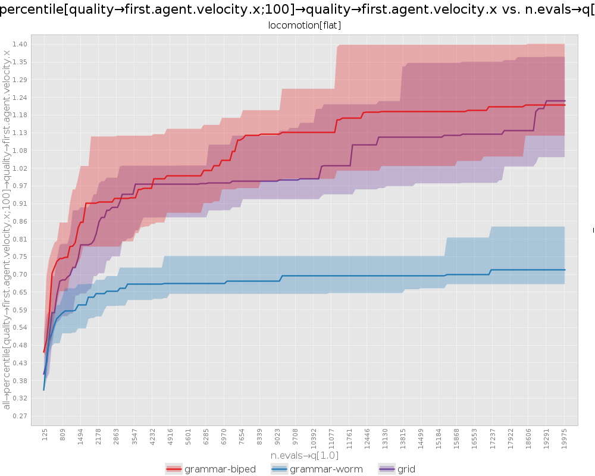

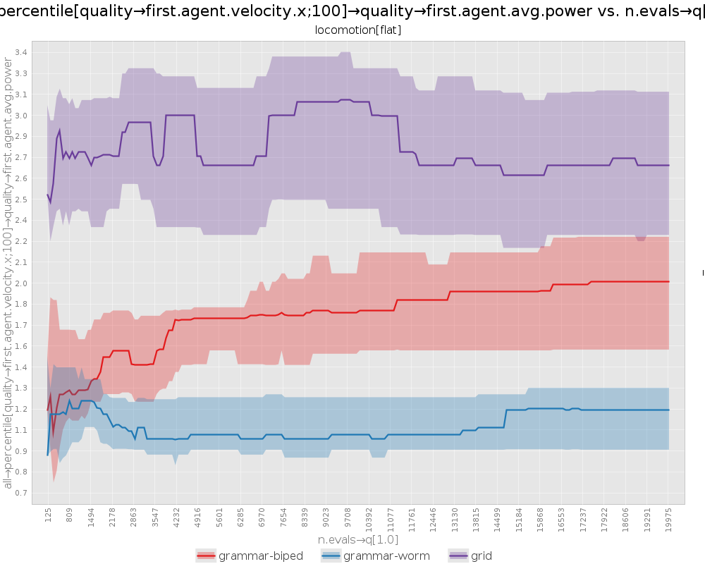

#### Sample videos of the final fastest robot

Videos from runs 1 to 5 (more in `results/vsr.txt/`).

##### With grid (no-grammar) representation

<video src="results/vsr.txt/video/v100-grammar-biped-0001.mp4" width=300/>

#### Objective plots

Plots from runs 1 to 5 (more in `results/vsr.txt/`).

##### With grid (no-grammar) representation

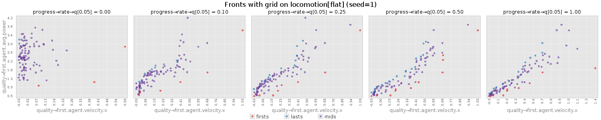

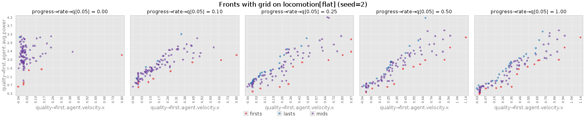

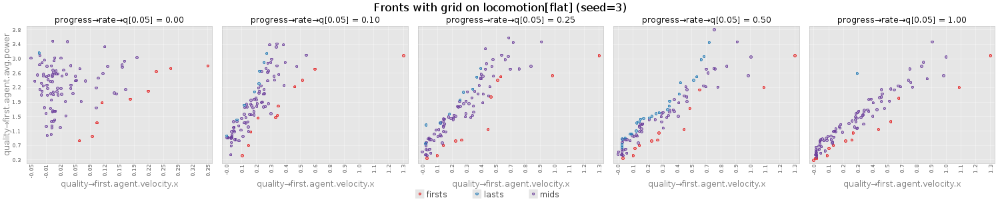

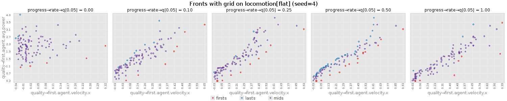

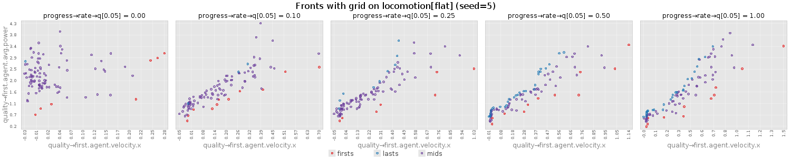

##### With biped-grammar representation

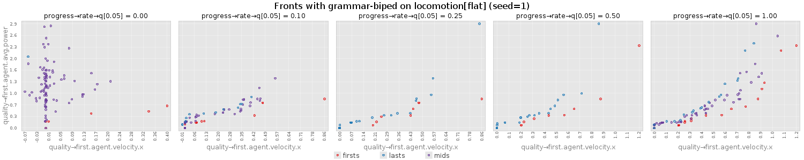

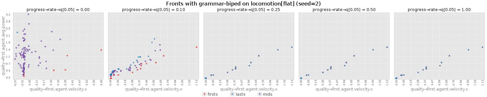

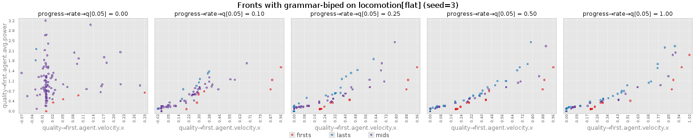

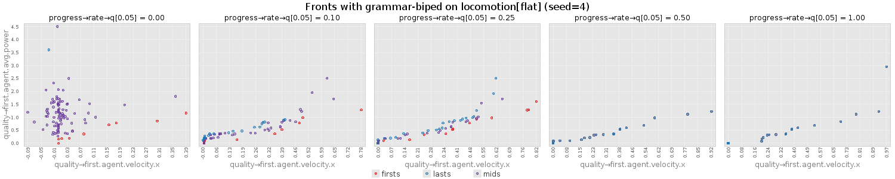

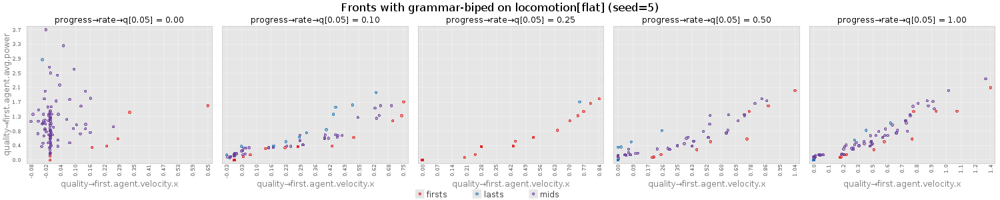

##### With worm-grammar representation

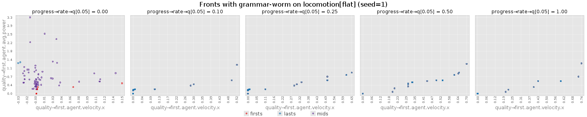

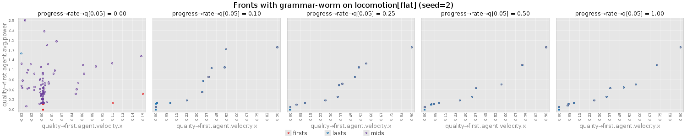

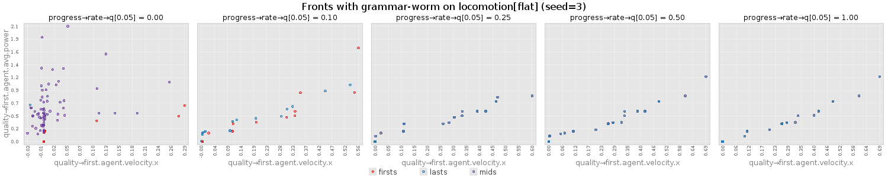

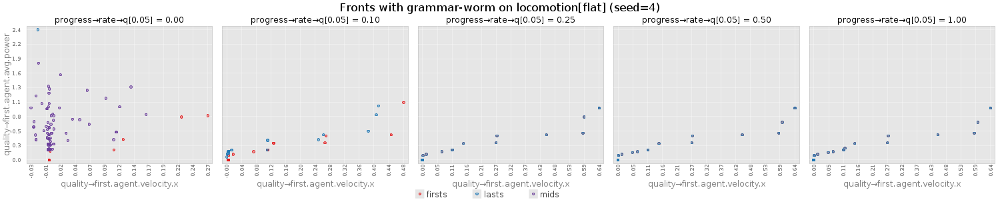

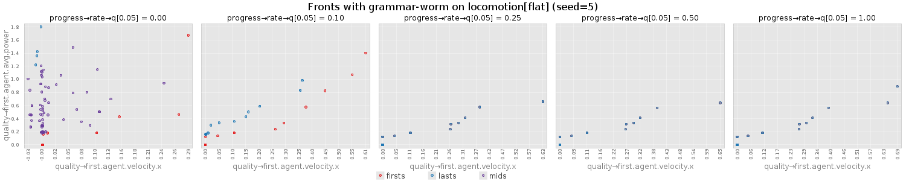
